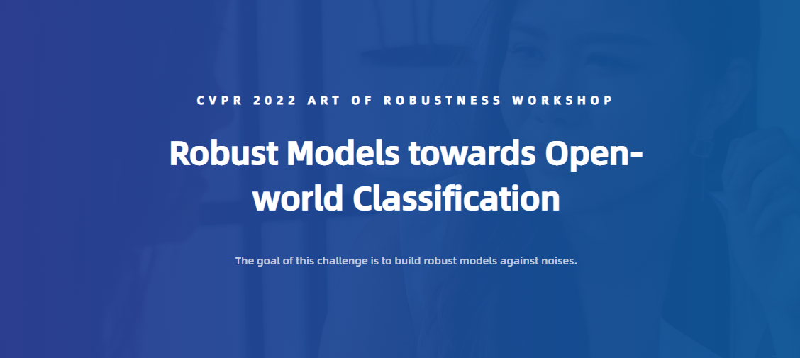

# A Simple and Effective Solution For AISafety CVPR2022

[](https://github.com/WindVChen/Solution-For-AISafety-CVPR2022)




<!-- TABLE OF CONTENTS -->
<li><a href="#Preface">Preface</a></li>
<li>
  <a href="#Details of CVPR2022 AISafety Challenge">Details of CVPR2022 AISafety Challenge</a>
  <ul>
    <li><a href="#Information of AISafety Challenge">Information of AISafety Challenge</a></li>
    <li><a href="#Environment">Environment</a></li>
    <li><a href="#Datasets">Datasets</a></li>
    <li><a href="#Details of Our Solution">Details of Our Solution</a></li>
    <li><a href="#Training Details">Training Details</a></li>
    <li><a href="#Inference Details">Inference Details</a></li>
    <li><a href="#CheckPoints">CheckPoints</a></li>
    <li><a href="#Conclusion">Conclusion</a></li>
  </ul>
</li>
<li><a href="#Reference">Reference</a></li>

---
## Preface
Hi, we are the team named **WindPassStreet** and this is our solution for Track1 in [AISafety CVPR2022 Challenge]((https://aisafety.sensetime.com/#/intro)). We provide a simple and effective way to reach a
robust model which can achieve high accuracy in the challenge. 

In this repository, we also provide our final submitted model weights for verification, due to the randomness of the attack sampled,
the score using the final weight can range from **88.12~89.08** (seems to be a big deviation). Maybe some kind of unlucky, our final submission
happened to be at a very low point, and now we are ranked at **5th**. Thus, please put aside the ranking for a moment, and just focus on our solution. 
We also provide some advice for alleviating randomness at last.

If you encounter any question, please feel free to contact us. You can create an issue or just send email to me 984958836@qq.com. Also welcome for any idea exchange and discussion.


---

## Details of CVPR2022 AISafety Challenge
### Information of AISafety Challenge
Please refer to [here](https://aisafety.sensetime.com/#/intro) for the details about the challenge, and our solution focuses on Track 1(Classification Task Defense)

### Environment
This code is based on [RobustART](https://github.com/DIG-Beihang/RobustART), the original RobustART is for DDP training, we re-change the code
and now it can support standard training, and also can both support Windows and Linux.

During the competition, we also get much help from the free GPU resource from [OpenI](https://openi.org.cn/). For easily implementing our code, we also share the environment Image
on OpenI, you can reach the environment [here](https://git.openi.org.cn/explore/images?type=myimage) by searching the keyword ```SWA```.

### Datasets
- Phase II data: **127390 images**, label ranged in 0~99
- Phase II label: **label.txt**

Before run our code, please first transform the label format. You can use ```label&Split.py``` in ```DataProcess``` directory
for the transformation. The final format should be like the example ```exampleForPhaseII.txt``` in ```DataProcess```.

### Details of Our Solution
In the challenge, we use a simple and straightforward strategy to resist the adversarial
attack, while keeping high accuracy on the clean images.

Our strategy is ```DataAugmentation + SwinTransformer-Tiny + High Softmax Temperature```. The code is based on [RobustART](https://github.com/DIG-Beihang/RobustART), and the following
is the details:
- **DataAugmentation**: We design a lot of data augmentation strategies apart from the original strategies in RobustART. You can
find these strategies in ```\prototype\prototype\data\custom_dataloader.py```, and the strategy ```AUGMIXMORECUSTOMAUTOAUG```
corresponds to our final result, where we use ```Augmix```, some ```Blur```, some ```Noise```, some ```ColorChange``` and
other else. It is verified that our strategy can far outperformed the ```AUTOAUG``` strategy which is originally provided by 
RobustART (**5 or more points boost**).
- **Classification Network**: We choose ```SwinTransformer-Tiny``` as our classifier, which is superior than
Resnet50 and Vit for adversarial defense (**2 or more points boost**).
- **PostProcessing**: Considering the white-box attack mainly depends on gradient propogation, here we just
enlarge the ```softmax temperature``` of the softmax layer in the inference phase. It is a very **Simple and Effective Operation** for the adversarial
 defense (**20 or more points boost**).

### Training Details
- First, please refer to [SwinTransformer](https://github.com/microsoft/Swin-Transformer) to train a SwinTransformer-Tiny in a standard way, as
the challenge forbids the use of pretrained model. Also, the train code for Swin-Transformer in RobustART seems failed to
reach a very good result, so we advise to train by the official implementation code (**1 or more points boost**).
- Then, you can train based on the model got from the first step, just run:

  ```python prototype/prototype/solver/cls_solver.py```
  
  Also you can change the settings according to your needs and interests in ```exprs\nips_benchmark\pgd_adv_train\vit_base_patch16_224\customconfigSwin.yaml``` 

### Inference Details
You can find our inference code in ```Inference``` directory, where we use the high softmax temperature.

### CheckPoints
We also provide our final result [here](https://drive.google.com/file/d/1HMIiESKASDoTnzaAD9G4ES_9zPIUlYKk/view?usp=sharing) for verification. Also should note that, as the white-box attack implemented
by the organizer is sampling according to certain parameters and the current final result is according to just one test, 
the final result maybe biased. Here, we advise to attack with **5 or more** random start for the robust evaluation, which can remove
some random biases.

### Conclusion
- Only one time robust test of attack is far from enough, the AR score can even have **1 point or more bias**, so it is better
to test for a few times to evaluate a method's robustness, which is also usually applied by many papers.
- Augmentation does matter, which can boost the accuracy on clean images and corruption images.
- High softmax temperature is effective for white-box attack. Also for score-based black box, just enlarge the softmax temperature
is a good defense operation.
---
## Reference
- [Swin transformer: Hierarchical vision transformer using shifted windows -- ICCV 2021](https://openaccess.thecvf.com/content/ICCV2021/papers/Liu_Swin_Transformer_Hierarchical_Vision_Transformer_Using_Shifted_Windows_ICCV_2021_paper.pdf)
- [Distillation as a Defense to Adversarial Perturbations Against Deep Neural Networks -- S&P 2016](https://arxiv.org/pdf/1511.04508.pdf&xid=25657,15700023,15700124,15700149,15700186,15700191,15700201,15700237,15700242.pdf)
- [Augmix: A simple data processing method to improve robustness and uncertainty -- ICLR 2020](https://arxiv.org/pdf/1912.02781.pdf)
